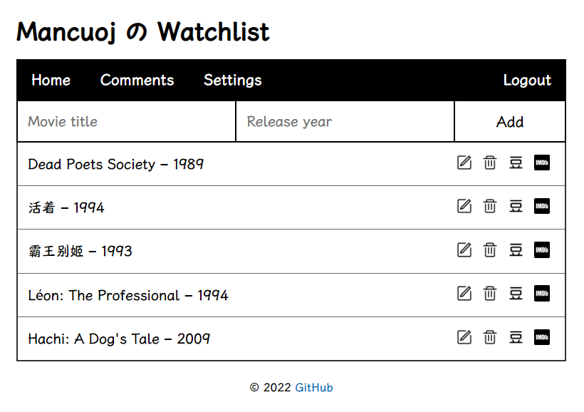
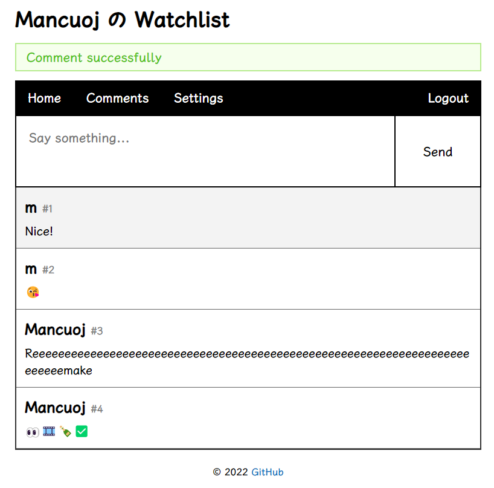

<br>
<p align="center">
    <a href="https://mancuoj.pythonanywhere.com/" target="_blank">
        
    </a>
</p>


<h1 align="center">
    Watchlist with comment area
</h1>


<p align="center">
    <a href="https://mancuoj.pythonanywhere.com/" target="_blank">Online Demo</a> |
    <a href="#screenshot">Screenshots</a> |
    <a href="./README_zh.md">中文文档</a>
</p>


## Features

- [x]  Login & logout - flask-login
- [x]  Settings - update username
- [x]  Register - all users share one movie list
- [x]  CRUD - flask-wtf + flask-sqlalchemy
- [x]  Comment Area
- [x]  i18n - flask-babel
- [ ]  ...


## Usage

> In WSL-Ubuntu20.04 

```sh
git clone https://github.com/mancuoj/watchlist.git
cd watchlist

python3 -m venv env
. env/bin/activate
pip install -r requirements.txt

flask forge
flask admin
flask run
```

## Screenshots

<p align="center">
    
</p>

<p align="center">
    
</p>

## Thanks

- [Flask 入门教程](https://tutorial.helloflask.com/)
- [PythonAnywhere](https://www.pythonanywhere.com/)
- ...