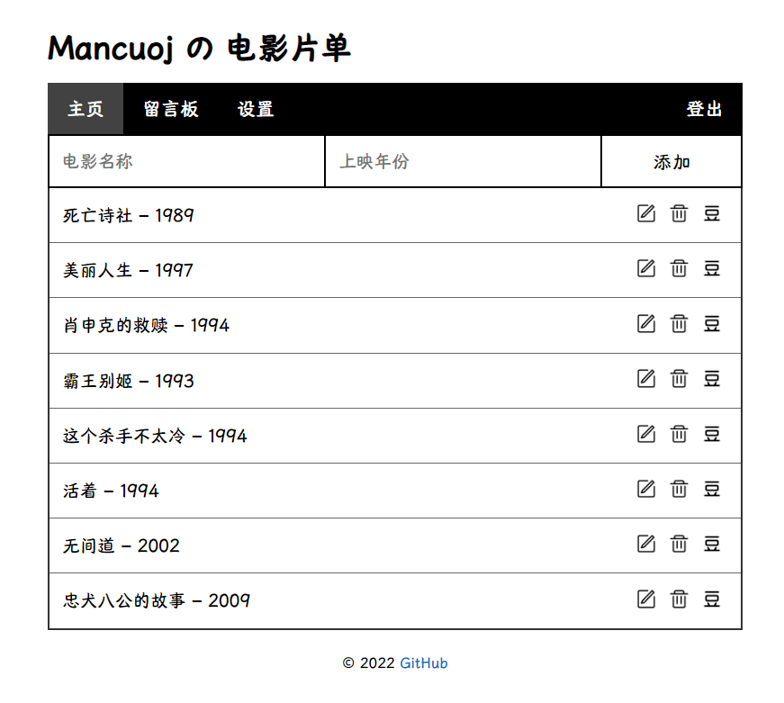
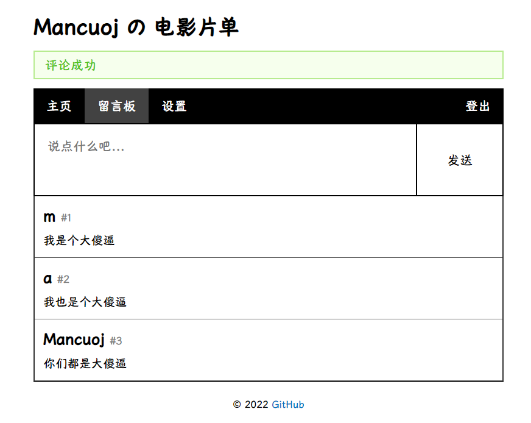

<p align="center">
    <a href="https://mancuoj.pythonanywhere.com/" target="_blank">
        
    </a>
</p>

<p align="center">
Flask 入门项目：电影片单 + 留言板
</p>

<p align="center">
    <a href="https://mancuoj.pythonanywhere.com/" target="_blank">在线查看</a> |
    <a href="#截图">截图</a> |
    <a href="https://tutorial.helloflask.com/deploy/" target="_blank">部署</a>
</p>


## 功能

- [x]  登录登出 - flask-login
- [x]  设置 - 用于更新用户名
- [x]  注册 - 所有用户共享一张电影列表
- [x]  增删改查 - flask-wtf + flask-sqlalchemy
- [x]  留言板
- [x]  国际化 i18n - flask-babel
- [ ]  ...


## 运行

> 本人环境为 WSL-Ubuntu20.04，其他系统同理

```sh
git clone https://github.com/mancuoj/watchlist.git
cd watchlist

python3 -m venv env
. env/bin/activate
pip install -r requirements.txt

flask forge
flask admin
flask run
```

## 截图

<p align="center">
    
</p>

<p align="center">
    
</p>

## 感谢

- [Flask 入门教程](https://tutorial.helloflask.com/)
- [PythonAnywhere](https://www.pythonanywhere.com/)
- ...